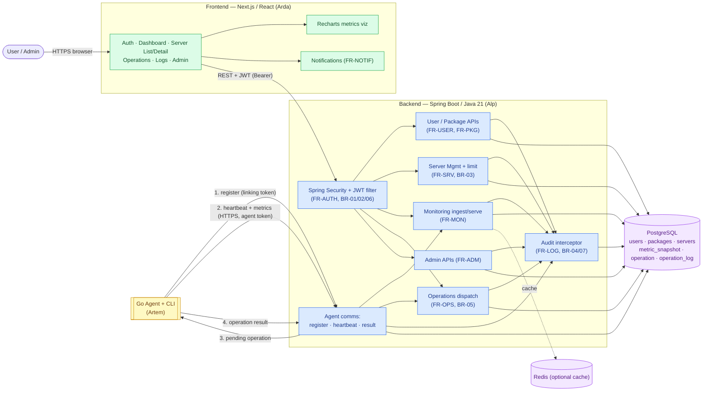
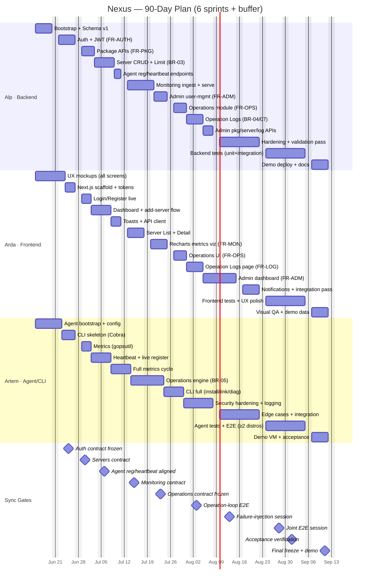

# Nexus — 90-Day Development Schedule

**Project:** Nexus — SaaS Server Management Platform
**Team:** Alp (Backend / Spring Boot), Arda (Frontend / Next.js), Artem (Agent & CLI / Go)
**Methodology:** 6 × 2-week sprints + 6-day buffer/polish phase
**Calendar convention:** Day 1 = Monday. Work is assigned Mon–Fri only. In every sprint the working days are **Days X+0…X+4** and **X+7…X+11**; the two Sat/Sun pairs are rest/light-review days. Saturdays are reserved for optional async PR review and merge-queue cleanup; Sundays are fully off.

---

## Legend & Cross-Cutting Conventions

- **API contract artifact:** All endpoint contracts are committed to a shared `docs/api-contracts/` folder as OpenAPI fragments + example payloads. "Contract sync" means Alp publishes/updates that file and pings Arda/Artem.
- **Branch strategy:** `main` (protected) ← `develop` ← feature branches. Demo builds tagged at each sprint end.
- **Definition of Done per task:** code merged to `develop`, relevant FR satisfied, smoke-tested, contract doc updated where the task touches an interface.

---

# System Architecture

> How the three workstreams fit together at runtime. Arda's frontend and Artem's agent both talk to Alp's Spring Boot backend; the backend is the only thing that touches PostgreSQL. The agent never receives arbitrary commands — it only executes whitelisted operations (BR-05).

**Operation loop (the BR-05 safety path), end to end:**
1. User clicks a predefined op in the UI → `POST /api/servers/{id}/operations` (ownership + whitelist validated).
2. Backend queues it `PENDING` and writes an audit log (BR-04).
3. Agent picks up the pending op on its next poll/heartbeat, runs it **only if it's in the local whitelist** (no arbitrary shell, BR-05).
4. Agent returns structured result → backend updates status + writes completion log → UI shows success/failure.

---

# Visual Timeline (Gantt)

> Anchored to **Day 1 = Mon 15 Jun 2026**. Weekends are excluded, so bar lengths are in *working days*. Bars show each developer's workstream span (approximate); the **Sync Gates** section marks the exact coordination dates from the checkpoint table. Renders automatically on GitHub, VS Code (Markdown Preview Mermaid Support), Obsidian, HackMD, and GitLab.

---

# SPRINT 1 — Foundation (Days 1–14)

## 1. Sprint Overview
Establish the skeleton of all three codebases so that no developer is blocked in Sprint 2. By the end of Sprint 1 we want: a Spring Boot app that can register/login a user and issue a JWT against a real PostgreSQL schema; a complete set of high-fidelity Figma mockups that lock the visual contract for every screen; and a runnable Go agent that loads YAML config and has the registration flow designed (even if the backend endpoint isn't live yet). This sprint is about **foundations and contracts**, not features.

## 2. Sprint Goals by Developer
- **Alp:** Spring Boot project bootstrapped; PostgreSQL schema v1 (users, roles, packages, user_package, servers stub); Flyway migrations; Authentication Module — `POST /api/auth/register`, `POST /api/auth/login`, JWT issuance + validation filter (FR-AUTH-01…06); password hashing (BCrypt); role enum (USER/ADMIN) seeded.
- **Arda:** Wireframes → high-fidelity mockups for Login, Register, User Dashboard, Server List, Server Detail, Operations, Operation Logs, Admin Dashboard; component inventory + Tailwind design tokens (color, spacing, typography); Next.js project scaffold with routing shell.
- **Artem:** Go agent repo + module layout; YAML config loader (`agent.yaml`: backend URL, token path, heartbeat interval); systemd unit file; CLI skeleton with command stubs (`nexus install|link|status|diag|restart`); design of the registration/linking-token flow (sequence doc).

## 3. Daily Breakdown

**Day 1 (Mon)**
- *Alp:* Initialize Spring Boot (Java 21) project; add Spring Web, Security, Data JPA, Flyway, PostgreSQL driver; Docker Compose for local Postgres; verify app boots.
- *Arda:* Audit all required screens against the FR list; produce low-fi wireframes for Login + Register + Dashboard.
- *Artem:* Initialize Go module; define folder structure (`/cmd/agent`, `/cmd/cli`, `/internal/config`, `/internal/heartbeat`, `/internal/metrics`, `/internal/ops`); commit skeleton.

**Day 2 (Tue)**
- *Alp:* Design ER diagram v1 (users, roles, packages, user_package, servers placeholder); write Flyway `V1__init.sql`; entity classes `User`, `Role`, `Package`.
- *Arda:* Wireframes for Server List + Server Detail + Operations screens; define navigation/IA (sidebar vs topbar decision).
- *Artem:* Implement YAML config loader + struct validation; unit test config parsing with sample `agent.yaml`.

**Day 3 (Wed)**
- *Alp:* Implement registration: `POST /api/auth/register` with Bean Validation, duplicate-email check, BCrypt hashing (FR-AUTH-01, FR-AUTH-02, FR-AUTH-03). Persist USER role by default.
- *Arda:* Begin high-fidelity mockups (Login + Register) in Figma using locked design tokens; define form states (empty, error, loading).
- *Artem:* Write systemd service unit; document agent lifecycle (install → enable → start); draft registration/linking-token sequence diagram.

**Day 4 (Thu)**
- *Alp:* Implement login: `POST /api/auth/login`, credential check, JWT issuance with claims (userId, role, exp) (FR-AUTH-04, FR-AUTH-05); add JWT secret to config.
- *Arda:* High-fidelity Dashboard mockup — package info card, server count, server summary list (FR-USER-01…04, FR-PKG-01…03).
- *Artem:* CLI skeleton using Cobra; wire `nexus --help`; stub `install`, `link`, `status`, `diag`, `restart` with placeholder output.

**Day 5 (Fri)**
- *Alp:* JWT validation filter + `SecurityFilterChain`; protect a test `/api/me` endpoint; role-based access scaffolding (FR-AUTH-06, FR-AUTH-07, BR-01, BR-06). **Publish `auth` contract v1.**
- *Arda:* High-fidelity Server List + Server Detail mockups (status labels FR-SRV-12…14, metric cards FR-MON-01…05).
- *Artem:* Finalize linking-token flow doc; **review `auth` contract draft with Alp** to align on how agents will later authenticate.

**Days 6–7 (Sat/Sun):** Rest. Optional: Alp tags `sprint1-mid` build for self-review.

**Day 8 (Mon)**
- *Alp:* Refine auth error handling (global `@ControllerAdvice`, structured error body); document stateless-JWT logout/session approach (FR-AUTH-08, FR-AUTH-09).
- *Arda:* High-fidelity Operations screen + confirmation modal mockups (FR-OPS-01…05); Operation Logs table mockup (FR-LOG-01…05).
- *Artem:* Implement registration HTTP client stub in agent (calls `/api/agent/register` against a local mock); error/retry scaffolding.

**Day 9 (Tue)**
- *Alp:* Seed data: default packages (Free=1, Pro=5, Business=20) and one ADMIN user (FR-PKG-01, FR-ADM-01). Write seed migration.
- *Arda:* High-fidelity Admin Dashboard mockups — user list, package management, platform logs (FR-ADM-01…06, FR-PKG-ADMIN-01…04).
- *Artem:* Define agent metrics data model (CPU %, mem, disk, uptime, timestamp); **draft metrics/heartbeat payload proposal** for Alp.

**Day 10 (Wed)**
- *Alp:* Integration tests for register + login (happy + failure paths) using Testcontainers Postgres.
- *Arda:* Design notification/toast states (success/error/warning/info) (FR-NOTIF-01…05); define empty/loading/error states across pages.
- *Artem:* Implement Cobra `status` command (reads config + token presence, prints health); unit tests for CLI arg parsing.

**Day 11 (Thu)**
- *Alp:* Harden auth (rate-limit placeholder, DTO validation); **freeze auth contract v1** so Arda can integrate in Sprint 2.
- *Arda:* Next.js scaffold — Tailwind, design tokens, base layout, routing for `/login`, `/register`, `/dashboard`, `/servers`, `/admin`; shared primitives (Button, Input, Card).
- *Artem:* Bundle CLI skeleton + config + systemd into a coherent `agent bootstrap`; README for local agent dev.

**Day 12 (Fri)**
- *Alp:* Sprint cleanup; merge auth module to `develop`; demo prep (Postman/HTTPie collection).
- *Arda:* Figma handoff — export specs, mark mockups "approved"; **design review with Alp + Artem** (screens vs available data).
- *Artem:* Agent bootstrap demo (config load + CLI status + systemd install on test VM); merge to `develop`.

**Days 13–14 (Sat/Sun):** Rest / sprint demo recording.

## 4. Sprint Deliverables
- Working register/login with JWT against PostgreSQL (FR-AUTH-01…07), merged + demoable.
- Flyway schema v1 with seeded packages + admin user.
- Complete approved high-fidelity mockups for **all** screens.
- Next.js scaffold with routing + base components.
- Go agent that loads config, installs as systemd service, responds to `nexus status`; registration flow designed.

## 5. Integration Checkpoints
- **Day 5:** Auth contract v1 published; Artem reviews for agent-auth implications.
- **Day 9:** Artem drafts agent metrics/heartbeat payload for Sprint 2 alignment.
- **Day 11:** Auth endpoints frozen → unblocks Arda's Sprint 2 integration.
- **Day 12:** Cross-team mockup review (data availability vs UI).

## 6. Risk Flags
- JWT/session model ambiguity (FR-AUTH-08/09) — decide and document early.
- Agent-auth scheme undecided — agent uses a linking token, not user JWT; settle before Sprint 2.
- Mockup scope creep — freeze designs by Day 12 or contracts drift.

---

# SPRINT 2 — Core Backend + Frontend Scaffolding (Days 15–28)

## 1. Sprint Overview
Turn the authenticated skeleton into a usable account system. Alp builds package and server management with **package-limit enforcement** (BR-03). Arda makes Login/Register/Dashboard real — wired to live backend APIs. Artem brings the agent to life: it sends heartbeats and collects real CPU/memory/disk/uptime metrics, and we stand up the first agent↔backend handshake. This is the sprint where the three codebases first talk to each other.

## 2. Sprint Goals by Developer
- **Alp:** Package Management APIs (FR-PKG-01…06); Server Management CRUD (FR-SRV-01…11) with package limit enforcement (BR-03, FR-SRV-03); server status field + ownership scoping (BR-02); User Account APIs (FR-USER-01…06).
- **Arda:** Functional Login + Register pages wired to `/api/auth/*`; token storage + protected-route guard; Dashboard scaffold (package info + server count); global API client + error/toast wiring (FR-NOTIF-01…04).
- **Artem:** Heartbeat system (periodic HTTPS POST); metrics collection via gopsutil (FR-MON-01…04); first integration against Alp's agent register + heartbeat endpoints.

## 3. Daily Breakdown

**Day 15 (Mon)**
- *Alp:* `Server` entity + migration V2 (id, owner_id, name, host, status, created_at); owner-scoped repository queries (BR-02).
- *Arda:* Login page form + validation; integrate `POST /api/auth/login`; store JWT; redirect on success (FR-AUTH-04, FR-NOTIF-02).
- *Artem:* gopsutil collectors: CPU % and memory used/total; unit tests with mocked readings.

**Day 16 (Tue)**
- *Alp:* `GET /api/servers` (own only) + `POST /api/servers` with limit check → 403 when over limit (FR-SRV-01…03, BR-03). **Publish `servers` contract v1.**
- *Arda:* Register page; integrate `POST /api/auth/register`; success → redirect; surface duplicate-email error (FR-AUTH-01…03, FR-NOTIF-03).
- *Artem:* Disk usage + uptime collectors; assemble unified `MetricsSnapshot` struct matching the Day-9 proposal.

**Day 17 (Wed)**
- *Alp:* `GET/PUT/DELETE /api/servers/{id}` — owner-scoped, 404/403 on cross-user access (FR-SRV-04…07, BR-02).
- *Arda:* Protected-route guard + auth context/provider; redirect unauthenticated → `/login` (BR-01); API client with JWT injection + 401 handling.
- *Artem:* Heartbeat loop (ticker on configured interval); HTTPS POST to `/api/agent/heartbeat` (against mock first).

**Day 18 (Thu)**
- *Alp:* Package APIs: `GET /api/packages`, `GET /api/me/package`, `GET /api/me` (FR-PKG-01…03, FR-USER-01…04). **Contract sync: Alp shares `/api/me` + `/api/me/package` with Arda.**
- *Arda:* Dashboard scaffold — fetch package + server count; render package card + usage indicator (FR-USER-04, FR-PKG-03).
- *Artem:* **Integration checkpoint with Alp:** finalize agent register + heartbeat contract (endpoints, token header format).

**Day 19 (Fri)**
- *Alp:* Implement **agent registration** `POST /api/agent/register` (linking token → server binding → agent token) and **heartbeat** `POST /api/agent/heartbeat` (token validation, update last_seen, status ONLINE) (FR-SRV-08, FR-MON-09). Publish `agent` contract v1.
- *Arda:* Dashboard server-summary list (name + status badges) from `GET /api/servers` (FR-USER-05, FR-SRV-12…14); wire global toasts.
- *Artem:* Point agent at **live** backend; first real register + heartbeat round-trip on test VM.

**Days 20–21 (Sat/Sun):** Rest. Sat: review server/package merges.

**Day 22 (Mon)**
- *Alp:* Status lifecycle — mark OFFLINE when no heartbeat within threshold (scheduled job) (FR-SRV-13, FR-MON-09). **Agent-backend sync: Artem + Alp align heartbeat payload + timeout threshold.**
- *Arda:* Dashboard polish — loading/empty/error states; "add server" CTA respecting limit (disable + tooltip at limit) (FR-SRV-03, FR-NOTIF-05).
- *Artem:* Harden heartbeat — retry/backoff on network failure, token persistence on disk (secure perms), offline buffering decision.

**Day 23 (Tue)**
- *Alp:* User Account — editable profile, server usage count endpoint (FR-USER-02, FR-USER-06); validation pass on server/package DTOs.
- *Arda:* Reusable status badge (ONLINE/OFFLINE/PENDING) + package-usage progress bar; connect to live data.
- *Artem:* Send full `MetricsSnapshot` in heartbeat (CPU/mem/disk/uptime) — backend logs it for now (pre-wires Sprint 3) (FR-MON-01…04).

**Day 24 (Wed)**
- *Alp:* Integration tests — package-limit enforcement (over limit → 403), ownership isolation (A cannot GET B's server) (BR-02, BR-03).
- *Arda:* "Add Server" form + modal — submit `POST /api/servers`, show success/over-limit toast (FR-SRV-02, FR-SRV-03).
- *Artem:* CLI `link` — accepts linking token, calls `/api/agent/register`, stores agent token; `status` reflects registration.

**Day 25 (Thu)**
- *Alp:* Server "test connection" endpoint (FR-SRV-08) — connectivity from last heartbeat; refine status labels (FR-SRV-12…14).
- *Arda:* Wire Add-Server flow end-to-end; refresh dashboard/list after add; verify limit-block UX.
- *Artem:* CLI `diag` — local metrics + connectivity check; CLI `restart` — restart systemd service.

**Day 26 (Fri)**
- *Alp:* Merge package + server + user-account modules; update contract docs; demo prep.
- *Arda:* E2E manual test: register → login → dashboard → add server → listed; fix wiring; merge.
- *Artem:* Demo: agent registers via CLI `link`, heartbeats appear, server flips ONLINE; merge heartbeat + metrics.

**Days 27–28 (Sat/Sun):** Rest / sprint demo.

## 4. Sprint Deliverables
- Package + Server CRUD with limit enforcement + ownership isolation (FR-SRV-01…11, FR-PKG-01…06, BR-02, BR-03).
- Functional Login/Register/Dashboard wired to live backend, with add-server flow.
- Go agent registering, heartbeating, collecting real metrics; status flips ONLINE/OFFLINE.

## 5. Integration Checkpoints
- **Day 16:** `servers` contract v1 → Arda.
- **Day 18:** `/api/me` + package contract → Arda.
- **Day 18 & 22:** Agent register/heartbeat contract finalized; payload + timeout aligned (Artem ↔ Alp).
- **Day 19:** First live agent↔backend round-trip.

## 6. Risk Flags
- Agent token security (perms/rotation) from the start (BR-05).
- Heartbeat timeout tuning — too aggressive = false OFFLINE.
- Frontend token storage (cookie vs localStorage) — decide by Day 17.
- Limit-enforcement race — enforce at DB/transaction level.

---

# SPRINT 3 — Monitoring + Agent Integration (Days 29–42)

## 1. Sprint Overview
Make the platform observable and lay groundwork for operations. Alp builds monitoring ingestion + serving and starts admin user-management APIs. Arda builds Server List and Server Detail with real Recharts visualizations. Artem completes the full metrics cycle and builds the **predefined operations engine** (whitelist + execution + result) — the heart of BR-05.

## 2. Sprint Goals by Developer
- **Alp:** Agent comms ingestion (store snapshots, FR-MON-01…08); monitoring serve APIs (latest + time-series, FR-MON-05…10); Admin user-management APIs (FR-ADM-01…06, FR-PKG-ADMIN-01…03).
- **Arda:** Server List page (FR-SRV-09…14); Server Detail with metric cards + Recharts + last-updated (FR-MON-01…10); full server-management integration.
- **Artem:** Full metrics reporting cycle; Predefined Operations Engine (whitelist, safe `os/exec`, structured result) (FR-OPS-05…09, BR-05).

## 3. Daily Breakdown

**Day 29 (Mon)**
- *Alp:* `metric_snapshot` table + migration V3; ingest snapshots on heartbeat (FR-MON-01…04, FR-MON-08).
- *Arda:* Server List page — table/grid with status badges, host, last-seen (FR-SRV-09…14); integrate `GET /api/servers`.
- *Artem:* Refactor heartbeat to embed full metrics snapshot reliably; verify backend persists each snapshot.

**Day 30 (Tue)**
- *Alp:* `GET /api/servers/{id}/metrics/latest` (FR-MON-05, FR-MON-09). **Publish `monitoring` contract v1.**
- *Arda:* Server List interactions — row click → Detail route; empty/loading states; refresh action (FR-MON-06).
- *Artem:* Design operations engine — whitelist schema (op id, label, command template, allowed args); document fixed op set (FR-OPS-01, FR-OPS-05, BR-05).

**Day 31 (Wed)**
- *Alp:* `GET /api/servers/{id}/metrics?from&to` time-series with downsampling/limit (FR-MON-07, FR-MON-10). **Contract sync: metrics endpoints → Arda.**
- *Arda:* Server Detail scaffold — header + metric summary cards from `metrics/latest` (FR-MON-01…05).
- *Artem:* Whitelist registry in Go (no arbitrary command path; args validated) (BR-05, FR-OPS-05).

**Day 32 (Thu)**
- *Alp:* Admin user-management `GET /api/admin/users`, `GET /api/admin/users/{id}` ADMIN-only (FR-ADM-01…03, BR-06).
- *Arda:* Integrate Recharts — CPU line chart from time-series; tooltip + axis formatting (FR-MON-07).
- *Artem:* Op execution runner — `os/exec` with timeout, capture stdout/stderr/exit code into structured result (FR-OPS-08, FR-OPS-09).

**Day 33 (Fri)**
- *Alp:* Admin assign-package `PUT /api/admin/users/{id}/package` (FR-PKG-ADMIN-03, FR-ADM-04, BR-07 log placeholder).
- *Arda:* Memory + disk charts; last-updated timestamp + manual refresh (FR-MON-06, FR-MON-09).
- *Artem:* Operations request/result API proposal. **Pre-sync with Alp** for Sprint 4.

**Days 34–35 (Sat/Sun):** Rest. Sat: review monitoring + admin merges.

**Day 36 (Mon)**
- *Alp:* Snapshot retention/cleanup job; index `metric_snapshot(server_id, captured_at)`.
- *Arda:* Server Detail — recent logs placeholder + responsive chart layout; loading skeletons.
- *Artem:* Wire ops engine to poll/receive pending operations (FR-OPS-06, FR-OPS-07).

**Day 37 (Tue)**
- *Alp:* Integration tests — snapshot ingestion → metrics/latest; cross-user metrics blocked (BR-02).
- *Arda:* Polish charts — color tokens, responsive breakpoints, "no data yet" state.
- *Artem:* Agent reports op result `POST /api/agent/operations/{id}/result` (FR-OPS-09, FR-OPS-10).

**Day 38 (Wed)**
- *Alp:* Admin user detail enrichment — servers count + package + status (FR-ADM-02, FR-ADM-05); pagination (FR-ADM-06).
- *Arda:* Full server-management pass — edit + delete with confirm dialog (FR-SRV-05…07, FR-NOTIF-04…06).
- *Artem:* E2E dry run of ops engine against mock dispatcher; unsupported-op rejection (FR-OPS-11, BR-05).

**Day 39 (Thu)**
- *Alp:* **Agent-backend sync: Alp + Artem freeze operations dispatch/result contract** (request shape, poll vs push, result payload, idempotency).
- *Arda:* Server List/Detail bug-fix + UX review vs mockups; verify badges match backend states.
- *Artem:* Agent logging subsystem — structured logs for heartbeat/metrics/op outcomes (FR-OPS-12).

**Day 40 (Fri)**
- *Alp:* Merge monitoring + admin-user modules; update contracts; demo prep.
- *Arda:* Merge Server List + Detail + charts; E2E: agent metrics → chart updates; demo prep.
- *Artem:* Merge operations engine + metrics cycle; demo whitelisted op + rejection.

**Days 41–42 (Sat/Sun):** Rest / sprint demo.

## 4. Sprint Deliverables
- Live monitoring: agent metrics stored + visualized via Recharts (FR-MON-01…10).
- Server List + Detail fully integrated.
- Admin user-management + assign-package (FR-ADM-01…06, FR-PKG-ADMIN-03).
- Operations engine: whitelist, execution, structured result, rejection (FR-OPS-05…11, BR-05).
- Operations dispatch/result contract frozen.

## 5. Integration Checkpoints
- **Day 30 & 31:** Monitoring contract → charts.
- **Day 33:** Operations contract proposal.
- **Day 39:** Operations contract frozen (Alp + Artem).

## 6. Risk Flags
- Time-series query performance — index + retention by Day 36.
- Operations dispatch model (poll vs push) — lock by Day 39.
- Chart data gaps for fresh servers — degrade gracefully.
- Command-injection surface in ops engine — strict arg validation (BR-05).

---

# SPRINT 4 — Operations + Logs + Admin (Days 43–56)

## 1. Sprint Overview
Complete the operations request→result→log loop across all three layers and stand up the logging/audit backbone (BR-04, BR-07). Alp builds the backend operations module + operation-logs APIs + admin package/server/log APIs. Arda builds the operations UI + filterable logs page and starts the admin dashboard. Artem ships the full CLI and hardens agent security/logging.

## 2. Sprint Goals by Developer
- **Alp:** Operations Module (`POST /api/servers/{id}/operations` → dispatch → process result, FR-OPS-01…12); Operation Logs (FR-LOG-01…10, BR-04, BR-07); Admin package CRUD (FR-PKG-ADMIN-01…06); admin server/log APIs (FR-ADM-07…10).
- **Arda:** Operations interface (FR-OPS-01…05, FR-OPS-10); Operation Logs page with filtering (FR-LOG-04…08); admin dashboard screens begin.
- **Artem:** CLI full implementation (`install/link/status/diag/restart`); agent security hardening (BR-05); agent logging finalize.

## 3. Daily Breakdown

**Day 43 (Mon)**
- *Alp:* `operation` + `operation_log` tables + migration V4; `POST /api/servers/{id}/operations` validates ownership + op validity (FR-OPS-01, FR-OPS-02, BR-02, BR-05).
- *Arda:* Operations UI — fetch available predefined ops, render list with descriptions (FR-OPS-01, FR-OPS-04).
- *Artem:* CLI `install` — place binary, write config, install+enable systemd unit, idempotent.

**Day 44 (Tue)**
- *Alp:* Dispatch pipeline — queue op PENDING, expose to agent via frozen contract; status transitions (FR-OPS-06, FR-OPS-07). **Publish operations backend contract v1 for Arda.**
- *Arda:* Confirmation modal (FR-OPS-03); wire to `POST .../operations`.
- *Artem:* CLI `link` hardening — validate token format, clear errors, store agent token `0600` (BR-05).

**Day 45 (Wed)**
- *Alp:* Process agent result — update status + persist output; **write operation log on submission and completion** (FR-OPS-09, FR-OPS-12, FR-LOG-01, BR-04).
- *Arda:* Operation result display — poll status, show running/success/failure + output (FR-OPS-08, FR-OPS-10, FR-NOTIF-02…04).
- *Artem:* CLI `status` (registration, last heartbeat, token, service state); `restart` robustness.

**Day 46 (Thu)**
- *Alp:* Operation Logs APIs — `GET /api/logs` (own only, BR-02) with filters (date, action, server) (FR-LOG-02…07). **Contract sync: logs contract → Arda.**
- *Arda:* Operation Logs page — filterable table + pagination (FR-LOG-04…08).
- *Artem:* CLI `diag` — local diagnostics (metrics, connectivity, config, service health) into one report.

**Day 47 (Fri)**
- *Alp:* Admin package CRUD `POST/PUT/DELETE /api/admin/packages` (FR-PKG-ADMIN-01…06, BR-06); **log every admin action** (FR-ADM-12, BR-07).
- *Arda:* Operations + Logs bug-fix; verify confirm→execute→result→log appears in Logs page end to end.
- *Artem:* Security hardening — enforce whitelist at execution boundary, reject any op not in registry (BR-05, FR-OPS-11).

**Days 48–49 (Sat/Sun):** Rest. Sat: review operations + logs merges.

**Day 50 (Mon)**
- *Alp:* Admin server + log APIs — `GET /api/admin/servers`, `GET /api/admin/logs` ADMIN-only (FR-ADM-07…10, FR-LOG-09/10, BR-06, BR-07).
- *Arda:* Admin dashboard scaffold — layout, admin-only guard (FR-ADM-01, BR-06), user table from `GET /api/admin/users`.
- *Artem:* **Agent-backend sync: Artem + Alp test full operation loop E2E** (UI submit → dispatch → execute → result → log).

**Day 51 (Tue)**
- *Alp:* Operation logs enrichment (actor, action, target, timestamp, outcome); **audit aspect/interceptor** so every action logs (BR-04, BR-07).
- *Arda:* Admin package-management — list/create/edit/delete + assign to user (FR-PKG-ADMIN-01…06, FR-ADM-04).
- *Artem:* Agent logging finalize — rotation, levels, secret redaction; document log locations.

**Day 52 (Wed)**
- *Alp:* Integration tests — log on every action (BR-04); admin action logged (BR-07); user blocked from admin (BR-06); cross-user op blocked (BR-02).
- *Arda:* Admin user-management — view detail, assign package, see servers/usage (FR-ADM-02…05).
- *Artem:* CLI E2E on clean VM — install → link → status → diag → restart; fix gaps.

**Day 53 (Thu)**
- *Alp:* Standardize error responses (operations/logs/admin); validation pass; finalize admin contract docs.
- *Arda:* Admin platform-logs screen — all logs with filters (FR-ADM-10, FR-LOG-09); reuse logs table.
- *Artem:* Agent edge handling — op timeout, agent offline mid-op, result-delivery retry (FR-OPS-12).

**Day 54 (Fri)**
- *Alp:* Merge operations + logs + admin modules; demo prep (operation loop + audit trail).
- *Arda:* Merge operations UI + logs + admin user/package screens; demo prep.
- *Artem:* Merge full CLI + hardening + logging; demo full CLI lifecycle + secure op rejection.

**Days 55–56 (Sat/Sun):** Rest / sprint demo.

## 4. Sprint Deliverables
- Full operations loop UI → dispatch → execute → result → audit log (FR-OPS-01…12, BR-04, BR-05).
- Operation Logs page + APIs with filtering; every action logged (FR-LOG-01…10, BR-04, BR-07).
- Admin package CRUD + admin server/log APIs (FR-PKG-ADMIN-01…06, FR-ADM-07…10).
- Admin dashboard functional; complete CLI + hardened logging agent.

## 5. Integration Checkpoints
- **Day 44:** Operations backend contract → Arda.
- **Day 46:** Logs contract → Arda.
- **Day 50:** Full operation-loop integration test (Artem + Alp).

## 6. Risk Flags
- Audit completeness — interceptor/aspect over per-endpoint logging (BR-04/07).
- Operation result delivery reliability — agent must retry result POST.
- Admin guard gaps — every admin endpoint needs the ADMIN check (BR-06).
- CLI on diverse distros — test on ≥2 distros.

---

# SPRINT 5 — Admin Panel + Full Integration (Days 57–70)

## 1. Sprint Overview
Finish the admin experience and make the whole system robust and consistent. Alp finalizes admin APIs, standardizes errors, and does a security-hardening + validation sweep. Arda completes the admin dashboard, ships the notification system platform-wide, and does a full API-integration pass (no mock data). Artem runs full agent-backend integration testing against real edge cases and polishes the CLI.

## 2. Sprint Goals by Developer
- **Alp:** Admin dashboard APIs finalized (FR-ADM-01…12); platform-wide logs (FR-LOG-09/10); security hardening (authz audit, JWT expiry, rate limiting); standardized errors; backend-wide validation.
- **Arda:** Admin dashboard full + polish (FR-ADM-01…12, FR-PKG-ADMIN-*); notification/feedback system (FR-NOTIF-01…08); full API integration pass.
- **Artem:** Full agent-backend integration testing; edge cases (offline, failed op, token expiry, partition); CLI polish + docs.

## 3. Daily Breakdown

**Day 57 (Mon)**
- *Alp:* Authz audit — verify every endpoint enforces ownership (BR-02) + role (BR-06); centralize checks.
- *Arda:* Admin overview — platform stats (user/server counts, recent activity) (FR-ADM-01, FR-ADM-11).
- *Artem:* Edge case — server offline mid-heartbeat → status OFFLINE; verify last-seen (FR-SRV-13, FR-MON-09).

**Day 58 (Tue)**
- *Alp:* JWT expiry + refresh decision (FR-AUTH-05, FR-AUTH-08); consistent 401. **Contract sync with Arda on 401/refresh.**
- *Arda:* Notification system — global toast provider for all states (FR-NOTIF-01…06).
- *Artem:* Edge case — agent token expiry/rotation; graceful re-auth without losing config.

**Day 59 (Wed)**
- *Alp:* Rate limiting + brute-force protection on auth (FR-AUTH-10); security headers; CORS finalization.
- *Arda:* Wire notifications into every action (add/edit/delete server, run op, admin actions) (FR-NOTIF-02…07).
- *Artem:* Edge case — failed operation (non-zero exit/timeout) → FAILED + surfaced to UI (FR-OPS-10, FR-OPS-12).

**Day 60 (Thu)**
- *Alp:* Standardize error response schema across ALL modules; global exception mapping.
- *Arda:* Admin package + user-management final polish vs mockups (FR-ADM-02…06).
- *Artem:* **Agent-backend full integration test session with Alp** under failure injection; log defects.

**Day 61 (Fri)**
- *Alp:* Backend-wide input validation pass — Bean Validation on every DTO; injection review.
- *Arda:* Admin platform-logs final — filters, pagination, performance at scale (FR-ADM-10, FR-LOG-09).
- *Artem:* Edge case — backend down → agent buffers + retries without crashing; recovery verified.

**Days 62–63 (Sat/Sun):** Rest. Sat: triage defect log from Day 60.

**Day 64 (Mon)**
- *Alp:* Fix authz/validation defects; re-run integration tests; finalize admin APIs (FR-ADM-12).
- *Arda:* Full API integration pass — eliminate any remaining mock/hardcoded data; verify all states.
- *Artem:* CLI polish — output formatting, exit codes, `--json` flag, helpful errors.

**Day 65 (Tue)**
- *Alp:* Redis (optional) decision — cache packages/metrics-latest or document deferral; perf check on heavy endpoints.
- *Arda:* Responsive pass on admin dashboard + dense tables; modal accessibility.
- *Artem:* Re-test full edge-case matrix after backend fixes.

**Day 66 (Wed)**
- *Alp:* Security review — secrets management, JWT secret rotation doc, no stack-trace leakage.
- *Arda:* Notification final — dismiss, stacking, auto-timeout, error detail expansion (FR-NOTIF-07/08).
- *Artem:* CLI docs + help; agent install/troubleshooting guide.

**Day 67 (Thu)**
- *Alp:* Cross-cutting integration test — full user journey via API green.
- *Arda:* Cross-browser check; fix visual regressions; verify admin vs user nav gating (BR-06).
- *Artem:* E2E agent flow re-run on two distros; sign off edge cases.

**Day 68 (Fri)**
- *Alp:* Merge hardening + admin finalization; finalize contract docs; demo prep.
- *Arda:* Merge admin dashboard + notifications + integration pass; demo prep.
- *Artem:* Merge CLI polish + edge handling; demo failure-injection resilience.

**Days 69–70 (Sat/Sun):** Rest / sprint demo. **Feature-complete for MVP.**

## 4. Sprint Deliverables
- Complete admin dashboard fully integrated (FR-ADM-01…12).
- Platform-wide notification/feedback system (FR-NOTIF-01…08).
- Hardened backend: consistent errors, full validation, authz audited, rate limiting (FR-AUTH-10, BR-02, BR-06).
- Agent resilient to offline/failed-op/token-expiry/partition.
- No mock data anywhere in the frontend.

## 5. Integration Checkpoints
- **Day 58:** 401/token-refresh aligned (Alp + Arda).
- **Day 60:** Failure-injection integration session (Alp + Artem).
- **Day 64–65:** Post-fix re-test across all layers.

## 6. Risk Flags
- Token-refresh complexity — keep simple (re-login/re-link).
- Edge-case regressions — rely on Day 67 cross-cutting test.
- Scope temptation — Redis is optional; don't derail MVP.
- Authz drift — new endpoints must pass Day 57 audit checklist.

---

# SPRINT 6 — Polish + Testing + Bug Fixes (Days 71–84)

## 1. Sprint Overview
Stabilize and prove the MVP. All three run E2E testing and verify every acceptance criterion against its FR. Alp writes backend unit/integration tests for critical invariants. Arda writes frontend component/validation tests + UX polish. Artem writes agent tests and proves the end-to-end agent flow. No new features — only quality.

## 2. Sprint Goals by Developer
- **Alp:** Backend unit tests (auth, package-limit BR-03, ownership BR-02, operation logging BR-04, admin guard BR-06); integration suite; fix defects.
- **Arda:** Component + form-validation tests; responsive fixes; UX polish; accessibility + error-state coverage.
- **Artem:** Agent tests (metrics, heartbeat, op exec, unsupported-op rejection BR-05); E2E agent flow; CLI tests.

## 3. Daily Breakdown

**Day 71 (Mon)**
- *Alp:* Unit tests — auth (register/login/JWT, FR-AUTH-01…07); fix bugs.
- *Arda:* Component tests (Button, Input, StatusBadge, Toast, Table); set up testing-library.
- *Artem:* Unit tests — metrics collectors with mocked readings (FR-MON-01…04).

**Day 72 (Tue)**
- *Alp:* Unit tests — package-limit (over limit → blocked, BR-03) + ownership isolation (BR-02).
- *Arda:* Form-validation tests — register/login/add-server/edit-server (FR-AUTH/SRV/NOTIF).
- *Artem:* Tests — heartbeat scheduling, retry/backoff, payload correctness.

**Day 73 (Wed)**
- *Alp:* Tests — operation logging on every action (BR-04) + admin-action logging (BR-07).
- *Arda:* Responsive fixes — dashboard, list/detail, admin tables across breakpoints.
- *Artem:* Tests — op execution + structured result; **unsupported-op rejection** (BR-05, FR-OPS-11).

**Day 74 (Thu)**
- *Alp:* Integration tests — admin guard (user → 403 on all admin endpoints, BR-06); cross-user blocked.
- *Arda:* UX polish — spacing/typography vs mockups; skeletons; empty states; toast consistency.
- *Artem:* E2E agent flow on clean VM: install→link→heartbeat→metrics→operation→result.

**Day 75 (Fri)**
- *Alp/Arda/Artem:* **E2E integration session (all three)** — full user + admin + agent operation journeys together; log defects.

**Days 76–77 (Sat/Sun):** Rest. Sat: defect triage + prioritization.

**Day 78 (Mon)**
- *Alp:* Fix P1 backend defects; re-run tests.
- *Arda:* Fix P1 frontend defects; accessibility pass (focus traps, aria labels).
- *Artem:* Fix P1 agent defects; re-run suite.

**Day 79 (Tue)**
- *Alp:* **Acceptance verification (backend)** — each MVP criterion → confirmed + FR cited; document gaps.
- *Arda:* **Acceptance verification (frontend)** — all screens vs criteria.
- *Artem:* **Acceptance verification (agent)** — register/heartbeat/metrics/op vs criteria.

**Day 80 (Wed)**
- *Alp:* Performance — query timings on metrics/logs under load; add indexes/limits.
- *Arda:* Performance — bundle size, chart render, table virtualization if needed.
- *Artem:* Resource check — agent CPU/mem footprint over long runs; no leaks.

**Day 81 (Thu)**
- *Alp:* Fix P2 defects; raise coverage on critical paths; finalize test report.
- *Arda:* Fix P2 UI defects; cross-browser final; finalize frontend report.
- *Artem:* Fix P2 agent defects; finalize agent report + E2E evidence.

**Day 82 (Fri)**
- *Alp:* Regression run; merge fixes; tag `sprint6-rc`.
- *Arda:* Regression run; merge fixes; visual QA sign-off.
- *Artem:* Regression run; merge fixes; agent sign-off.

**Days 83–84 (Sat/Sun):** Rest / RC review.

## 4. Sprint Deliverables
- Backend test suite covering BR-02…BR-07 + auth.
- Frontend component + validation tests; responsive + accessible UI.
- Agent test suite incl. unsupported-op rejection (BR-05); proven E2E agent flow.
- Acceptance-criteria verification document with FR citations.
- Release candidate tagged.

## 5. Integration Checkpoints
- **Day 75:** Joint E2E session.
- **Day 79:** Coordinated acceptance verification across all layers.

## 6. Risk Flags
- Hidden defects surfacing late — keep Day 78/81 buffers.
- Test flakiness (Testcontainers / heartbeat timing) — stabilize.
- Acceptance gaps found Day 79 → triage into buffer immediately.

---

# FINAL PHASE — Buffer + Demo Prep (Days 85–90)

## Overview
Reserve for the unknowns: final bug fixes, late edge cases, demo environment setup, documentation cleanup, and a final formal acceptance-criteria verification. No new scope.

## Daily Breakdown

**Day 85 (Mon)**
- *Alp:* Fix remaining P1/P2 defects; fresh-DB boot test.
- *Arda:* Final UI polish; seeded demo-data screens.
- *Artem:* Final agent edge-case fixes; prep demo VM with agent installed + linked.

**Day 86 (Tue)**
- *Alp:* Demo env — deploy backend + Postgres (Docker Compose); seed packages, admin, demo users.
- *Arda:* Point frontend at demo env; verify flows; fix env/CORS.
- *Artem:* Connect demo agent(s); confirm live heartbeats + metrics + runnable operation.

**Day 87 (Wed)**
- *All:* **Full dress-rehearsal demo** of every acceptance criterion E2E (register/login → dashboard → add server within/over limit → own-servers-only → health metrics → predefined op → operation history → admin manage users/packages → user blocked from admin → cross-user isolation → clear feedback → agent register/heartbeat/metrics/op). Log failures.

**Day 88 (Thu)**
- *All:* Fix dress-rehearsal failures; docs cleanup — README, setup guide, API contracts, agent install guide, admin guide.

**Day 89 (Fri)**
- *All:* **Final acceptance verification** — formal pass/fail checklist with FR citations; freeze code; tag `v1.0.0-mvp`. Demo script + slides; assign roles (Alp: backend/admin, Arda: user flows/UI, Artem: agent/CLI).

**Day 90 (Sat)** — Light/final: buffer for last-minute fixes only; **final demo delivery**.

## Final Deliverables
- Deployed demo environment (backend + DB + frontend + ≥1 live agent).
- `v1.0.0-mvp` tag with all acceptance criteria verified against FRs.
- Complete documentation set.
- Demo script + rehearsed presentation.

## Risk Flags
- Demo-env-only bugs (CORS, TLS for agent HTTPS, env config) — surface Day 86, not Day 90.
- Agent over HTTPS — valid certs/trust on demo VM or heartbeats fail silently.
- Zero slack on Day 90 — everything substantive done by Day 89.

---

# Cross-Sprint Integration Checkpoint Summary

| Day | Checkpoint | Who |
|----|-----------|-----|
| 5 | Auth contract v1 published | Alp → Arda/Artem |
| 11 | Auth endpoints frozen | Alp → Arda |
| 16 | `servers` contract v1 | Alp → Arda |
| 18 | `/api/me` + package + agent register/heartbeat contract | Alp ↔ Artem/Arda |
| 22 | Heartbeat payload + timeout threshold aligned | Alp ↔ Artem |
| 30–31 | Monitoring contract for Recharts | Alp → Arda |
| 39 | Operations dispatch/result contract frozen | Alp ↔ Artem |
| 44 | Operations backend contract | Alp → Arda |
| 46 | Logs contract | Alp → Arda |
| 50 | Full operation-loop integration test | Alp ↔ Artem |
| 58 | 401/token-refresh behavior | Alp ↔ Arda |
| 60 | Failure-injection integration session | Alp ↔ Artem |
| 75 | Joint end-to-end session | All |
| 79 | Acceptance-criteria verification | All |
| 87 | Dress-rehearsal demo | All |
| 89 | Final acceptance verification + freeze | All |

---

# Per-Developer Timelines

## ALP — Backend (Spring Boot / PostgreSQL)

| Sprint | Days | Focus | Key FR / BR |
|--------|------|-------|-------------|
| S1 | 1–14 | Bootstrap, schema v1, Auth (register/login/JWT), roles, seed packages + admin | FR-AUTH-01…07, FR-PKG-01, BR-01, BR-06 |
| S2 | 15–28 | Package APIs, Server CRUD + limit, ownership, User Account, agent register/heartbeat endpoints, status lifecycle | FR-SRV-01…11, FR-PKG-01…06, FR-USER-01…06, BR-02, BR-03 |
| S3 | 29–42 | Metric ingestion + serving, monitoring APIs, Admin user-mgmt + assign-package | FR-MON-01…10, FR-ADM-01…06, FR-PKG-ADMIN-03 |
| S4 | 43–56 | Operations module, Operation Logs APIs, Admin package CRUD, admin server/log APIs, audit interceptor | FR-OPS-01…12, FR-LOG-01…10, FR-PKG-ADMIN-01…06, FR-ADM-07…10, BR-04, BR-07 |
| S5 | 57–70 | Authz audit, JWT expiry, rate limiting, error standardization, validation, admin finalization | FR-AUTH-10, FR-ADM-11/12, BR-02, BR-06 |
| S6 | 71–84 | Unit + integration tests (auth, limits, ownership, logging, guard), fixes, perf | BR-02…07, FR-AUTH |
| Buffer | 85–90 | Demo deploy, clean-boot, acceptance, docs | All |

**Alp's critical-path obligations:** D5 auth contract · D11 auth frozen · D16 servers contract · D19 agent endpoints live · D30–31 monitoring contract · D44 operations contract · D46 logs contract.

## ARDA — Frontend (Next.js / React / Tailwind)

| Sprint | Days | Focus | Key FR |
|--------|------|-------|--------|
| S1 | 1–14 | Wireframes → hi-fi mockups (all), tokens, Next.js scaffold, base components | All UI FRs (design) |
| S2 | 15–28 | Login/Register live, auth context + guard, API client, Dashboard scaffold + add-server, toasts | FR-AUTH-01…04, FR-USER-01…05, FR-NOTIF-01…05, BR-01 |
| S3 | 29–42 | Server List, Server Detail, Recharts CPU/mem/disk, last-updated + refresh, edit/delete | FR-SRV-09…14, FR-MON-01…10 |
| S4 | 43–56 | Operations UI, Operation Logs page, admin dashboard begins | FR-OPS-01…10, FR-LOG-04…08, FR-ADM-01…06, FR-PKG-ADMIN |
| S5 | 57–70 | Admin dashboard full, platform-wide notifications, full integration pass, responsive/a11y | FR-ADM-01…12, FR-NOTIF-01…08 |
| S6 | 71–84 | Component + validation tests, responsive fixes, UX polish, a11y, acceptance | FR-NOTIF, FR-SRV, FR-AUTH |
| Buffer | 85–90 | Point at demo env, visual QA, demo data, rehearsal | All |

**Arda's blocked-by dependencies:** auth frozen (D11) · servers contract (D16) · monitoring contract (D30–31) · operations + logs contracts (D44/46). Mitigation: build against published contract docs + mock adapters, then swap to live.

## ARTEM — Agent & CLI (Go)

| Sprint | Days | Focus | Key FR / BR |
|--------|------|-------|-------------|
| S1 | 1–14 | Go repo + layout, YAML config, systemd, CLI skeleton, registration flow design | Agent bootstrap |
| S2 | 15–28 | gopsutil metrics, heartbeat loop + HTTPS POST, first live register+heartbeat, CLI `link` | FR-MON-01…04, FR-SRV-08 |
| S3 | 29–42 | Full metrics cycle, operations engine (whitelist/exec/result/rejection), result POST | FR-OPS-05…11, BR-05 |
| S4 | 43–56 | CLI full, security hardening, agent logging | FR-OPS-11/12, BR-05 |
| S5 | 57–70 | Edge cases (offline, failed op, token expiry, partition), integration testing, CLI polish | FR-OPS-10/12, FR-SRV-13, FR-MON-09 |
| S6 | 71–84 | Agent tests (metrics, heartbeat, op exec, rejection), E2E on ≥2 distros, CLI tests | BR-05, FR-MON, FR-OPS |
| Buffer | 85–90 | Demo VM setup, live heartbeats/ops, agent acceptance | All |

**Artem's two-way syncs with Alp:** D18 register/heartbeat contract · D22 payload + timeout · D39 operations contract frozen · D50 operation-loop test · D60 failure-injection session.

---

# Critical Path

`Auth (D1–11) → Server CRUD (D15–17) → Agent endpoints (D19) → Heartbeat/metrics (D22–29) → Monitoring ingest+serve (D29–31) → Operations contract (D39) → Operations module (D43–45) → full loop (D50) → integration (D60) → E2E (D75) → acceptance (D79) → demo (D87–89).`

This is the line that, if it slips, slips the whole project — guard it.

---

# Risk Register

Severity = Likelihood × Impact. Owner is accountable; mitigation is the planned action.

| ID | Risk | Sprint | Lik. | Imp. | Sev. | Owner | Mitigation |
|----|------|--------|------|------|------|-------|-----------|
| R-01 | Auth/session model ambiguity → frontend rework | S1 | Med | High | High | Alp | Decide stateless-JWT by D8; freeze contract D11 |
| R-02 | Agent-auth scheme undecided blocks heartbeat | S1→S2 | Med | High | High | Artem+Alp | Linking-token flow D3 design + D18 contract |
| R-03 | Mockup scope creep → contracts drift | S1 | Med | Med | Med | Arda | Hard freeze + approval D12 |
| R-04 | Frontend token storage chosen wrong (XSS) | S2 | Med | High | High | Arda+Alp | Decide by D17; align CORS/refresh D58 |
| R-05 | Package-limit race bypasses limit (BR-03) | S2 | Low | High | Med | Alp | Enforce in DB transaction; test D24 |
| R-06 | Heartbeat timeout mistuned → false OFFLINE | S2 | Med | Med | Med | Artem+Alp | Align threshold D22; configurable grace |
| R-07 | Agent token at rest insecure (BR-05) | S2→S4 | Low | High | Med | Artem | `0600` from D24; rotation in S5 |
| R-08 | Time-series query perf degrades Detail | S3 | Med | Med | Med | Alp | Index + retention D36; perf check D80 |
| R-09 | Command-injection in ops engine (BR-05) | S3→S4 | Low | Critical | High | Artem | Strict whitelist + validated args; reject test D73 |
| R-10 | Operations dispatch model wrong (poll/push) | S3 | Med | High | High | Alp+Artem | Lock contract D39 before D43 |
| R-11 | Audit completeness gap (BR-04/07) | S4 | Med | High | High | Alp | Interceptor/aspect D51; test D73 |
| R-12 | Operation result delivery unreliable | S4→S5 | Med | Med | Med | Artem+Alp | Result-POST retry; timeout→FAILED; test D59 |
| R-13 | Admin guard gap (BR-06) | S4→S5 | Med | High | High | Alp | Authz audit D57; 403-for-user test D74 |
| R-14 | CLI fails on some distros | S4→S6 | Med | Med | Med | Artem | Test ≥2 distros (D52, D67); idempotent install |
| R-15 | Token-refresh complexity late | S5 | Med | Med | Med | Alp | Keep simple; align D58; defer if risky |
| R-16 | Edge-case regressions across layers | S5→S6 | High | Med | High | All | Cross-cutting E2E D67 + D75; regression D82 |
| R-17 | Hidden defects surface late | S6 | Med | High | High | All | Reserve D78/81 buffers; freeze features S5 end |
| R-18 | Test flakiness erodes CI trust | S6 | Med | Low | Low | Alp+Artem | Deterministic clocks/mocks |
| R-19 | Acceptance gaps found D79, little runway | S6 | Low | High | Med | All | Continuous mapping from S3; formal pass D79 |
| R-20 | Demo-env-only bugs (CORS/TLS/env) | Buffer | Med | High | High | All | Stand up demo env D86; valid certs on VM |
| R-21 | Zero slack on Day 90 | Buffer | Med | High | High | All | Everything substantive done by D89 |

**Top 5 to watch:** R-10/R-09 (operations contract + injection safety) · R-11/R-13 (audit + admin guards) · R-16/R-17 (regressions + late defects) · R-20/R-21 (demo-env surprises) · R-01/R-04 (early auth/session/storage decisions).
